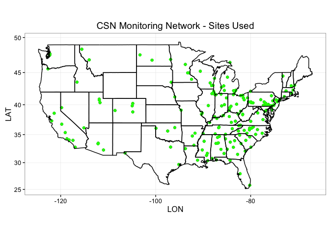
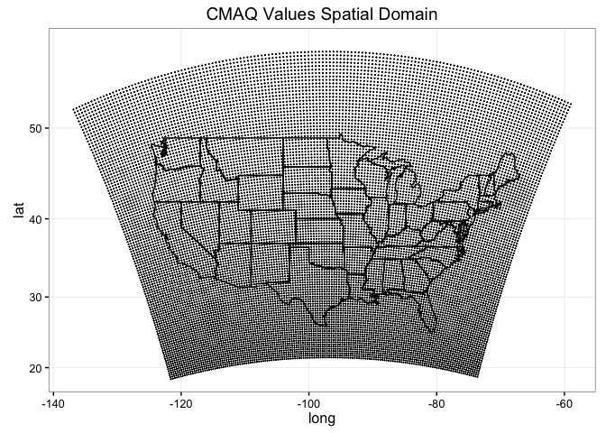

<!-- README.md is generated from README.Rmd. Please edit that file -->
Hybrid Source Apportionment
===========================

This is a package implementing a novel method for source apportionment of fine particulate matter(i.e., PM2.5). And an attempt at, um, [actual science](http://simplystatistics.org/2013/01/23/statisticians-and-computer-scientists-if-there-is-no-code-there-is-no-paper/).

Documentation is still (clearly) ongoing. Stay tuned!

Installation
------------

To install the package, you can run the following commands:

``` r
library(devtools)
install_github("nabilabd/hybridSA")
```

Motivation
----------

Observation data at monitoring sites is typically highly sparse, spatially. On the other hand, simulated concentrations of particulate matter, while perhaps much more dense, might suffer from certain occasional numerical inaccuracies. But, by combining both, it might be possible to produce estimates even better than either method individually.

Introduction
------------

This package is largely based around two functions: `hybridsa`, and `get_optim`.

Data
----

There are two inputs for the hybrid optimization:

-   Observed concentrations
-   Simulated concentrations

The observed concentrations consists of speciated PM2.5 (i.e., a breadown of particulate matter into different chemical elements it consists of or comes from) as well as PM2.5 mass. This values are obtained from the [EPA Air Quality Service (AQS)](http://aqsdr1.epa.gov/aqsweb/aqstmp/airdata/download_files.html#Daily) (under: "Particulates"). In `data-raw` is to be a script that downloads and consolidates the concentrations of these substances for 2005-2012 into a single file. Elaboration on how this data was obtained, how uncertainty calculations are performed, and more, is to be included in a forthcoming vignette.

    #> 
    #>  # maps v3.1: updated 'world': all lakes moved to separate new #
    #>  # 'lakes' database. Type '?world' or 'news(package="maps")'.  #

<!-- -->

The simulated concentrations are generated from [CMAQ](https://www.cmascenter.org/cmaq/) modeling. Each value corresponds to the daily average taken over a 36 x 36km grid, and is associated with the center of that grid cell. The entire spatial domain extends beyond the contiguous US, and consists of a 112 x 148 elements.

<!-- -->

Tutorials
---------

Since working with spatial (and spatio-temporal) data in `R` might seem intimidating, especially for those with less exposure to the language, I'm in the process of writing some tutorials, to help ease the learning curve, and make some the code used in this package more readily accessible. So far, there is:

-   [Working wtih Spatial Data](http://rpubs.com/nabilabd/134781)

-   [Spatial Interpolation with Kriging](http://rpubs.com/nabilabd/118172)

-   [Projecting Spatial Data](http://rpubs.com/nabilabd/142092)

-   [Working with netCDF files](http://rpubs.com/nabilabd/119121)

References
----------

Here are two papers which used an earlier version of the approach presented here:

-   [Fine particulate matter source apportionment using a hybrid chemical transport and receptor model approach](http://atmos-chem-phys.net/14/5415/2014/) by Hu et. al.

-   [Development of PM2.5 source impact spatial fields using a hybrid source apportionment air quality model](http://www.geosci-model-dev.net/8/2153/2015/gmd-8-2153-2015.html) by Ivey, C. et al.

This paper was also useful for background on methods used and some of the motivation:

-   [Source apportionment of PM2.5 in the southeastern United States](http://www.sciencedirect.com/science/article/pii/S1352231005011945) by Marmur et. al

Although this paper used a much smaller dataset than the first two, it makes up for it by presenting more of the intuition and rationale for incorporating certain components of the present implemenation.
